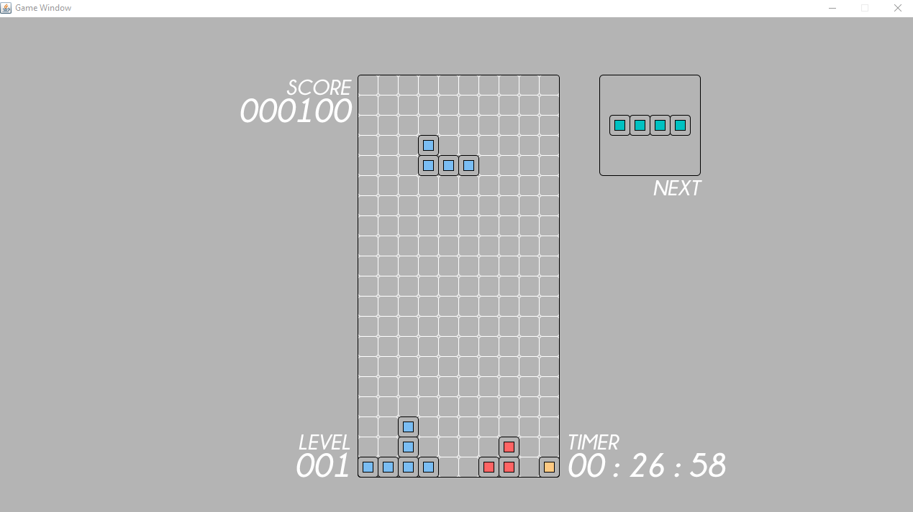
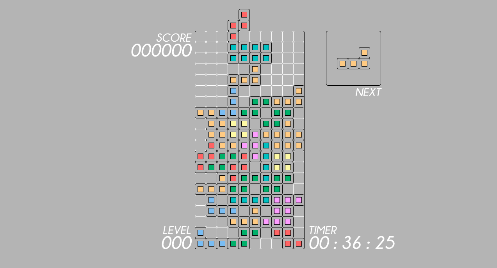

# Tetris

I created this game in 2015~2016 to demonstrate the usage of my final undegrad project, a simple game library built solely using Java. This library uses Swing as the UI layer. I built it entirely alone and it is fully original with no content copied from the internet.

I started to built this game in 2015, while I was studying in the USA, and in 2016 I separated its core into a game library, and made it my final undegrad project.

## How to build

- Install [ant](https://ant.apache.org/manual/install.html)
- Then from the root of this folder run `ant`
- Go to `/dist` and run `Tetris.jar`

## How to Play

- Move the piece with `A, W, D, S` or the `arrow keys`
- Rotate the piece with `E`
- Move the piece down faster by pressing `space bar`
